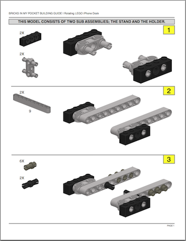

**As featured on:**

* [Engadget](http://www.engadget.com/2009/09/15/battle-of-the-homebrew-lego-iphone-docks/)
* [Hackaday](http://hackaday.com/2009/09/09/rotating-iphone-dock-from-legos/)
* [Gizmodo](http://gizmodo.com/5358067/diy-swivelling-lego-iphone-dock-fulfills-our-weekend-lego-quota)

You’ve asked for it and here it is! The official building instructions for my Rotating LEGO iPhone Dock are now available! This Dock makes the perfect companion for your iPhone or iPod Touch.

If you inject a bit of your own creativity, this MOC is easily adaptable to your computing environment or alternate device. Haven’t seen the Dock in action yet? Watch the YouTube video below.

  
<iframe src="https://www.youtube.com/embed/0PTE7P3JTGo" frameborder="0" allowfullscreen style="position:absolute;top:0;left:0;width:100%;height:100%;"></iframe>

I’ve taken the time to prepare detailed instructions (see sample image below) and all I ask is that you send a contribution by clicking [here](https://www.paypal.com/us/cgi-bin/webscr?cmd=_flow&amp;SESSION=g8rKLifnl50jI9sy8IcKDk7-7FM-Z6zrs2doD4IIVZDLFNEkV8ABsj2EL34&amp;dispatch=5885d80a13c0db1f8e263663d3faee8dc60d77e6184470d515cedf52660ea0cd) or by using the *Donation Button* found in the steps at the bottom of this page.

The recommended minimum donation is $1, but you can leave less. But if you feel you receive more value, feel free to let me know by dropping an extra tip into the pot. Now, on to the fine print.

I’m trying something new here. You can download the file at anytime; however, I have password protected the .pdf file. You can download it, but you can’t open it without the password. Once I receive a donation notification, I will use the e-mail you provide to send you the password.

To be honest, I’m not sure how I feel about this and not sure if I would like this as a user, but thought it would be an interesting study in free market electronic distribution. And let’s face it, the measures to protect this document only keep the honest folks honest. This process could change in the future, but for now, that’s it. So, use the steps below to get a copy of the official Rotating LEGO iPhone Dock building instructions.

<b>Step 1:</b> Click the Donate Button Below 
<form action="https://www.paypal.com/cgi-bin/webscr" method="post">
<input name="cmd" type="hidden" value="_s-xclick" /><input name="hosted_button_id" type="hidden" value="Q77KFAS9UQEJW" /><input alt="PayPal - The safer, easier way to pay online!" border="0" name="submit" src="https://www.paypal.com/en_US/i/btn/btn_donate_SM.gif" type="image" /></form>

<b><b> Step 2:</b>&nbsp;Wait for the Password to be Sent  
(This could be instantaneous or it might take a while. This is a manual process and “patience is a virtue”)</b>

<b> 
</b>

<b>Step 3:</b> Click the Download Button (10.9Mb Download)

 

 

<b>Step 4:</b> Check the errata area below for corrections and version information

That's all there is to it. Have questions or don't have a PayPal account? Drop me a message via e-mail to:

[steven.combs@gmail.com](mailto:steven.combs@gmail.com)

## LEGO Dock FAQ

**Q: Is there an existing set that you recommend to get me started?**

A: Not really. I put this together from my odds and ends bin. You might check current Technic sets. Most pieces are from Technic and Mindstorms sets. A good set might get you 80% of the way.

**Q: What if I can't find a part I need in my stash?**

A: I highly recommend [Bricklink](http://www.bricklink.com) where you can purchase single elements! The other alternative is to improvise. Look for other parts that serve the same purpose. That's the fun of LEGO. And you may just find that you version is better than mine! If you do, send me an [email](steven.combs@gmail.com) with a pic and share your idea.

## Errata

{December 29th, 2010} Version 1.0 is now posted and includes:

* Parts list!
* New, higher resolution image on title page
* On step 3, the instructions displayed 2 gray 3/4 technic pins and 6 black technic pins. It is actually the other way around; 6 3/4 pins and 2 normal pins needed - Thanks Tim!
* Several grammatical corrections
* Included links to software used
